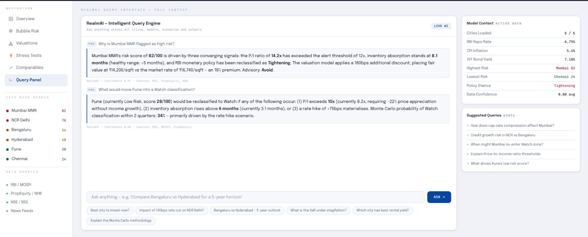

# 🏡 Real Estate Market Volatility & Bubble Detection Engine

## 📌 Overview
This project presents an AI-powered platform to detect real estate market bubbles using macroeconomic indicators, valuation models, and multi-agent intelligence.

## 🚀 Problem
Real estate markets often experience speculative price increases that are not aligned with economic fundamentals. Current systems fail to detect early warning signals.

## 💡 Solution
We propose a GenAI-based platform that integrates:

- Macroeconomic data (inflation, interest rates)
- Real estate indicators (price-to-income, rental yields)
- Market sentiment data

## ⚙️ Key Features
- 📊 Interactive Dashboard for market analysis
- 🤖 AI Chat Interface (Natural Language Queries)
- ⚠️ Bubble Risk Detection Engine
- 🔮 Scenario Simulation (what-if analysis)
- 📈 Investment Recommendations (Buy / Hold / Avoid)

## 🧠 GenW.AI Modules Used
- **AgentBuilder** – Multi-agent orchestration
- **RealmAI** – Natural language query system
- **AppMaker + Playground** – Dashboard and visualization

## 🏗️ Architecture
Multi-agent system including:
- Data ingestion agent
- Macro analysis agent
- Sentiment analysis agent
- Risk detection agent
- Advisory agent

## 📊 Business Impact
- 40–50% faster market analysis
- 30–40% improvement in decision accuracy
- Early detection of market bubbles
- Better capital allocation decisions

## 📁 Project Files
- Apex_Algorithm_Presentation.pdf

## 👥 Team
- Tushar Kumar
- Vaibhav Sharma
- Abhijay Pansari
- Sidrah Aaishah

## 📸 Project Preview

